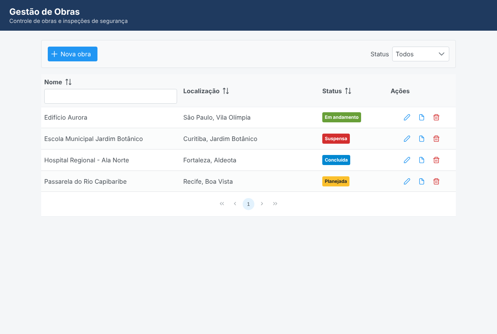

# Gestão de Obras — Jakarta EE (exemplo de estudo)

Aplicação de exemplo para preparação de entrevista técnica: CRUD de **Obras** e
**Relatórios de Segurança** com a stack Jakarta EE (antigo J2EE), sempre com
paralelos ao Spring Boot.

**Stack:** Java 17 · Jakarta EE 10 (JPA, EJB, CDI, JSF + PrimeFaces, JAX-RS) · H2/PostgreSQL · WildFly

## Progresso

| Passo | Tema | Status | Relatório |
|---|---|---|---|
| 1 | Modelo (JPA & OOP) | ✅ | [docs/passo-01-modelo-jpa.md](docs/passo-01-modelo-jpa.md) |
| 2 | DAO e EntityManager | ✅ | [docs/passo-02-dao-entitymanager.md](docs/passo-02-dao-entitymanager.md) |
| 3 | Camada de negócio (EJB) | ✅ | [docs/passo-03-ejb-negocio.md](docs/passo-03-ejb-negocio.md) |
| 4 | Frontend (JSF & PrimeFaces) | ✅ | [docs/passo-04-jsf-primefaces.md](docs/passo-04-jsf-primefaces.md) |
| 5 | Integração (API REST JAX-RS) | ✅ | [docs/passo-05-api-rest-jaxrs.md](docs/passo-05-api-rest-jaxrs.md) |

Transversal: [docs/solid.md](docs/solid.md) — onde cada princípio SOLID aparece no código e por quê.

## Pré-requisito: só o Java

Basta ter um **JDK 17 ou 21** instalado. O Maven e o WildFly são baixados automaticamente:

- **Maven Wrapper** (`mvnw` / `mvnw.cmd`): scripts que baixam a versão certa do Maven
  (3.9.11) na primeira execução e a guardam em `~/.m2/wrapper`. Você não precisa instalar o Maven.
- **Profile `wildfly`**: baixa do Maven Central a distribuição oficial do WildFly 35, descompacta
  em `target/` e o plugin `wildfly:run` inicia o servidor com a aplicação implantada.

Confira o Java com `java -version`. Se o comando não for encontrado, configure a variável de
ambiente `JAVA_HOME` apontando para a pasta do JDK (no Windows: *Painel de Controle → Sistema →
Configurações avançadas → Variáveis de Ambiente*).

## Executar

Na pasta `gestao-obras/`:

| Onde | Comando |
|---|---|
| Windows — Prompt de Comando (cmd) | `mvnw.cmd -Pwildfly package wildfly:run` |
| Windows — PowerShell | `.\mvnw.cmd -Pwildfly package wildfly:run` |
| Git Bash, Linux ou macOS | `./mvnw -Pwildfly package wildfly:run` |

Quando o log mostrar `Deployed "gestao-obras.war"`, abra **http://localhost:8080/gestao-obras/**.
Para parar o servidor, use **Ctrl+C** no terminal.

- A primeira execução demora mais: baixa o Maven (~10 MB) e o WildFly (~250 MB). Depois, tudo vem
  do cache local (`~/.m2`).
- Não é preciso configurar banco de dados: a aplicação usa o `java:comp/DefaultDataSource` do
  servidor (H2 em memória) e carrega dados de demonstração a cada inicialização.
- A porta **8080** precisa estar livre.
- No Windows, se aparecer erro de caminho longo ao descompactar o WildFly, coloque o projeto em
  uma pasta curta (ex.: `C:\dev\estudo`).

Só compilar (gera `target/gestao-obras.war`):

```bash
mvnw.cmd clean package      # Windows
./mvnw clean package        # Git Bash, Linux, macOS
```

Se preferir um WildFly instalado à mão, copie o WAR para `standalone/deployments/` do servidor e
inicie-o com `bin/standalone.bat` (Windows) ou `bin/standalone.sh`.



## API REST

Base: `http://localhost:8080/gestao-obras/api`

| Método e URL | O que faz |
|---|---|
| `GET /obras?nome=&status=` | Lista obras (filtros opcionais e combináveis) |
| `GET /obras/{id}` | Uma obra |
| `GET /obras/{id}/relatorios` | Relatórios da obra |
| `POST /obras/{id}/relatorios` | Registra relatório (201 + `Location`) |
| `GET /relatorios/recentes?limite=` | Últimos relatórios |
| `GET /relatorios/{id}` | Um relatório |
| `DELETE /relatorios/{id}` | Exclui relatório (204) |

```bash
curl http://localhost:8080/gestao-obras/api/obras?status=EM_ANDAMENTO
```

### Postman

Importe [`postman/gestao-obras-api.postman_collection.json`](postman/gestao-obras-api.postman_collection.json)
no Postman (**Import**): 24 requisições com testes automáticos e explicações, incluindo os casos
de erro (400, 404, 405, 406, 415, 422). Para rodar pela linha de comando, com o servidor no ar:

```bash
npx newman run postman/gestao-obras-api.postman_collection.json
```

(O `npx` vem com o Node.js.)
