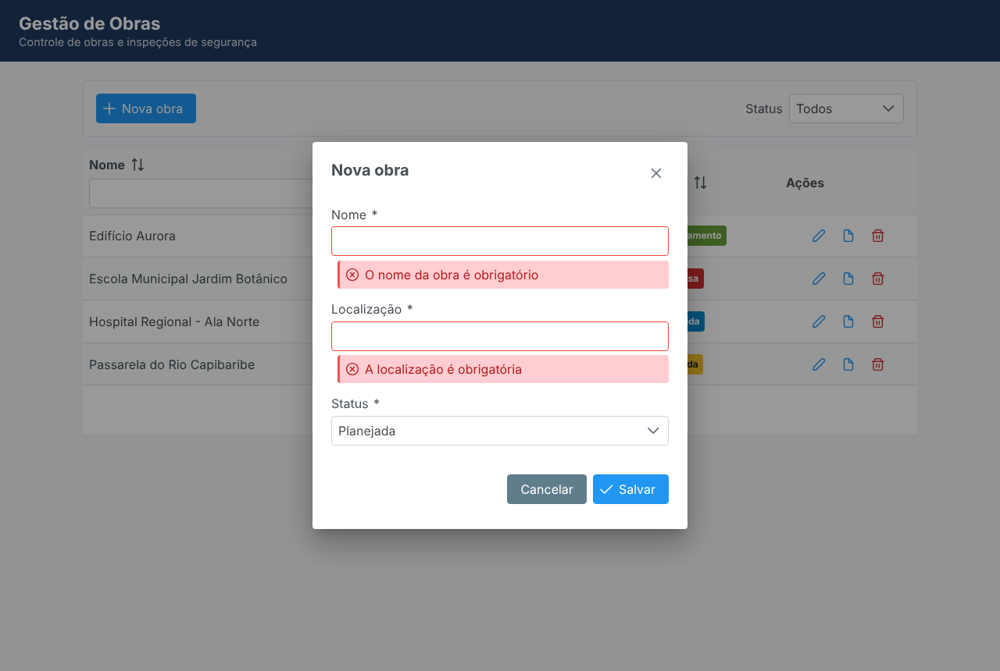
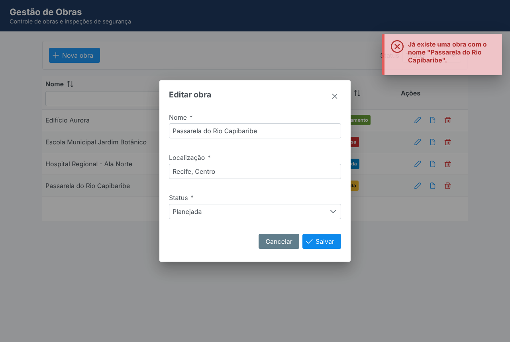
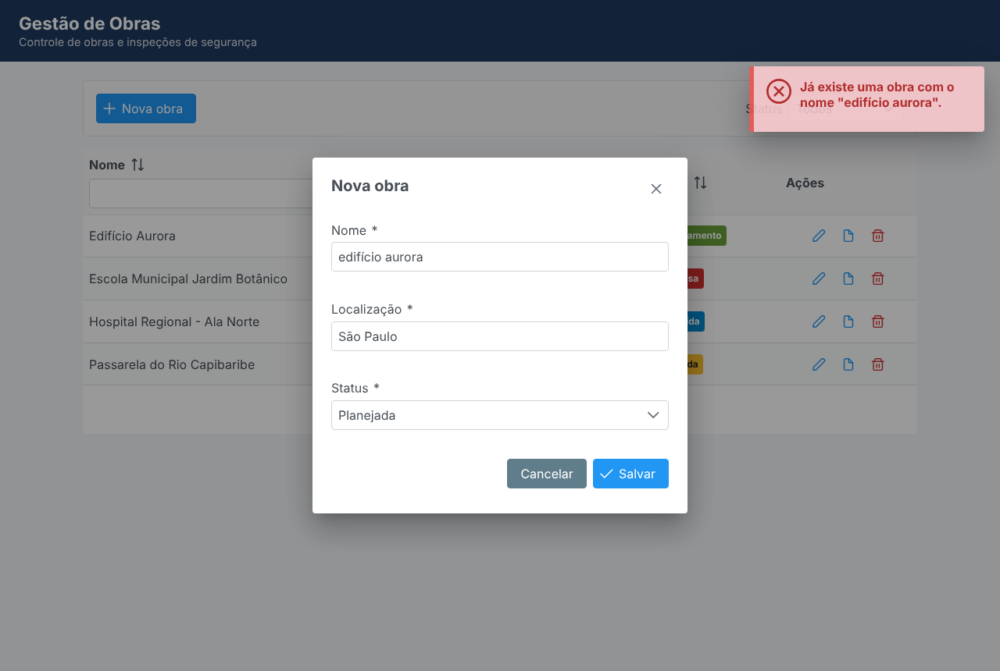
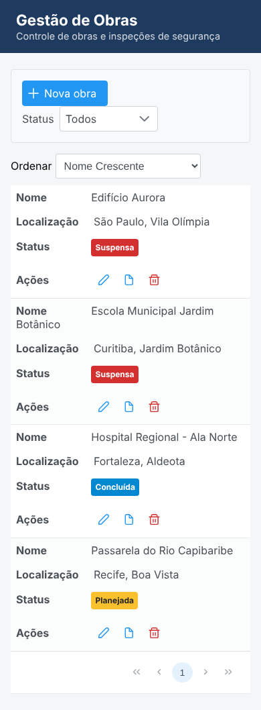
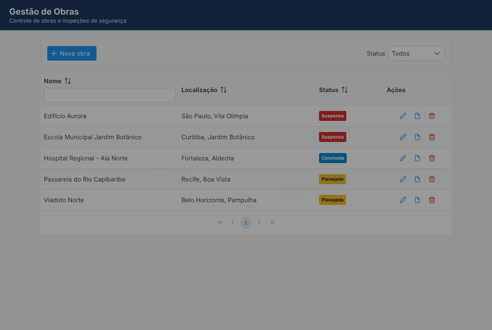
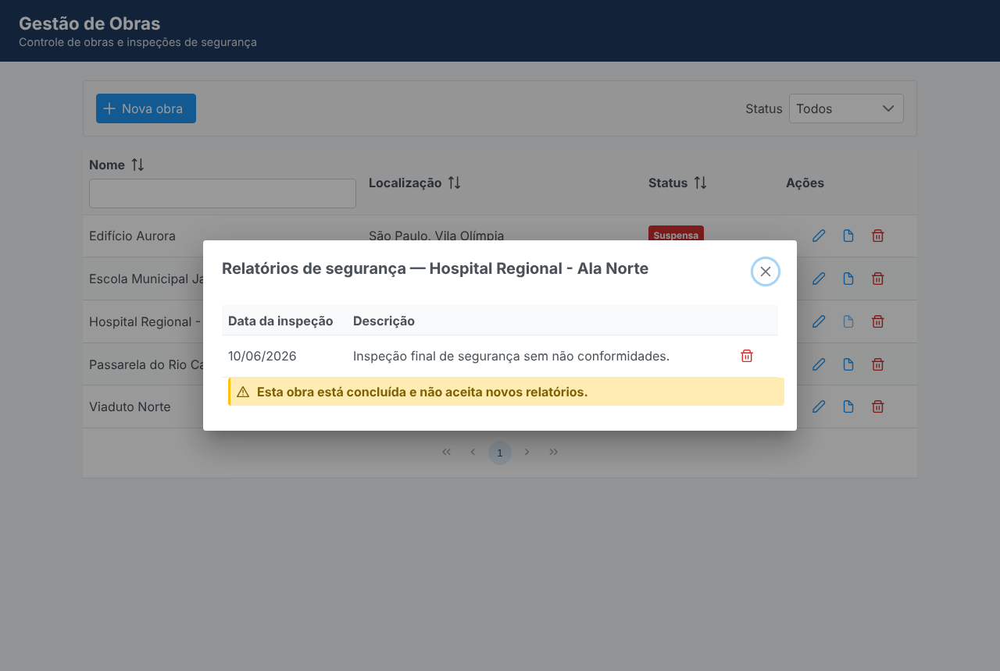
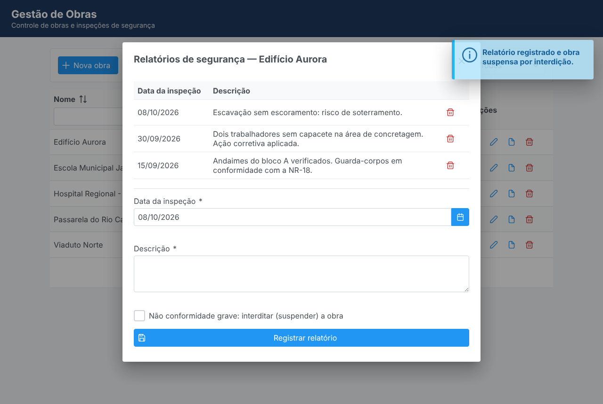

# Passo 4 — O Frontend (JSF & PrimeFaces)

> Neste passo a aplicação ganha uma tela de verdade. Sempre que uma sigla ou termo em
> inglês aparecer pela primeira vez, ele é explicado ali mesmo; no final há um
> **Glossário** para revisão rápida.


## Arquivos deste passo

```
gestao-obras/
├── pom.xml                                   ← + dependência do PrimeFaces
└── src/main/
    ├── java/br/com/exemplo/gestaoobras/
    │   ├── model/StatusObra.java             ← textos de tela removidos (foram para o messages.properties)
    │   └── web/
    │       ├── ObraBean.java                 ← controller da tela de obras
    │       ├── RelatorioSegurancaBean.java   ← controller do diálogo de relatórios
    │       └── Mensagens.java                ← atalhos para exibir mensagens na tela
    ├── resources/messages.properties         ← todos os textos da interface
    └── webapp/
        ├── obras.xhtml                       ← a tela (View)
        ├── resources/css/app.css             ← ajustes visuais
        └── WEB-INF/
            ├── web.xml                       ← configuração da aplicação web
            ├── faces-config.xml              ← configuração do JSF (idioma, textos)
            └── templates/layout.xhtml        ← modelo comum a todas as páginas
```

---

## 0. Antes de tudo: o que são essas tecnologias?

- **JSF** (*JavaServer Faces*, hoje chamado oficialmente **Jakarta Faces**): o *framework*
  web oficial do Jakarta EE. *Framework* é uma estrutura pronta que dita como você organiza
  o código e chama o seu código nos momentos certos (diferente de uma biblioteca, que é você
  quem chama). O JSF gera o **HTML** (*HyperText Markup Language*, a linguagem das páginas web)
  no **servidor** e envia pronto ao navegador.
- **Mojarra**: a implementação do JSF que vem dentro do WildFly. Assim como o JPA é uma
  especificação e o Hibernate a implementa, o JSF é uma especificação e o Mojarra (ou o
  **MyFaces**, da Apache) a implementa. Por isso o JSF não aparece no `pom.xml`: está no servidor.
- **Facelets**: a tecnologia de *templates* (modelos de página) do JSF. As páginas são
  arquivos **`.xhtml`** — **XHTML** (*eXtensible HTML*) é HTML escrito com as regras rígidas
  do **XML** (*eXtensible Markup Language*): toda tag precisa ser fechada, atributos sempre
  entre aspas etc.
- **PrimeFaces**: uma biblioteca com mais de 100 componentes visuais prontos para JSF
  (tabela com paginação, diálogo, calendário, mensagens flutuantes...) e com **AJAX**
  embutido (explicado na seção 4). Não faz parte da especificação Jakarta EE, por isso
  **é empacotado dentro do WAR** (está no `pom.xml` sem `<scope>provided</scope>`).
- **CDI** (*Contexts and Dependency Injection*): o mecanismo de injeção de dependências e
  de escopos do Jakarta EE (visto no Passo 2). Os *beans* da tela são beans CDI.

> 🟢 **Paralelo Spring Boot:** o equivalente mais próximo seria **Spring MVC + Thymeleaf**
> (também gera HTML no servidor). Hoje, no mundo Spring, é mais comum uma **SPA**
> (*Single Page Application*: uma aplicação em React/Angular que roda no navegador e só
> conversa com o servidor via API REST). O JSF segue o caminho oposto: o servidor controla a tela.

---

## 1. MVC no JSF

**MVC** (*Model-View-Controller*, Modelo-Visão-Controlador) é um padrão que separa uma
aplicação com interface em três papéis:

| Papel | O que faz | Neste projeto | No Spring MVC |
|---|---|---|---|
| **Model** (modelo) | Dados e regras de negócio | Entidades (`Obra`) + Services (`ObraService`) | Igual |
| **View** (visão) | O que o usuário vê | `obras.xhtml` + `layout.xhtml` | Template Thymeleaf |
| **Controller** (controlador) | Recebe as ações do usuário e coordena | `FacesServlet` + `ObraBean` / `RelatorioSegurancaBean` | `DispatcherServlet` + `@Controller` |

### O Front Controller: `FacesServlet`

Um **Servlet** é uma classe Java que recebe requisições **HTTP** (*HyperText Transfer
Protocol*, o protocolo da web) e devolve respostas. O `FacesServlet`, declarado no
`web.xml`, é um ***Front Controller*** ("controlador da frente"): **toda** requisição para
um `*.xhtml` passa primeiro por ele, que então executa o ciclo de vida do JSF (seção 2).

> 🟢 **Paralelo Spring Boot:** é exatamente o papel do `DispatcherServlet`, que o Spring
> Boot registra sozinho. No Jakarta EE, você declara no `web.xml`.

### O *backing bean*: `ObraBean`

O ***backing bean*** ("bean de apoio") é a classe Java que "dá suporte" a uma página: guarda
os dados exibidos e tem os métodos chamados pelos botões.

```java
@Named        // a página enxerga este bean como #{obraBean}
@ViewScoped   // vive enquanto o usuário estiver nesta tela (seção 3)
public class ObraBean implements Serializable { ... }
```

A página e o bean se conectam pela **EL** (*Expression Language*, linguagem de expressões),
as expressões `#{...}`:

| Na página | O que o JSF faz |
|---|---|
| `value="#{obraBean.obras}"` | Ao desenhar a página, chama `obraBean.getObras()` |
| `value="#{obraBean.obraEmEdicao.nome}"` em um campo | **Ida e volta** (*two-way binding*): ao desenhar, chama `getObraEmEdicao().getNome()`; ao enviar o formulário, chama `getObraEmEdicao().setNome(valorDigitado)` |
| `actionListener="#{obraBean.editar(obra)}"` | Ao clicar, chama o método `editar` passando a obra da linha |
| `#{msg['status.' += obra.status]}` | Monta a chave `"status.EM_ANDAMENTO"` (o `+=` concatena textos na EL) e busca no `messages.properties` |

> 🟢 **Paralelo Spring Boot:** no Thymeleaf seria `th:field="*{nome}"` com
> `@ModelAttribute` no controller. A diferença está explicada a seguir.

### A grande diferença: JSF é *component-based* e *stateful*

- **Spring MVC é *action-based* e *stateless*** ("baseado em ações" e "sem estado"): cada
  requisição chama um método do controller, que devolve o nome de uma página e um modelo
  de dados. Depois disso, o servidor **não guarda nada** sobre aquela tela.
- **JSF é *component-based* e *stateful*** ("baseado em componentes" e "com estado"): o
  servidor monta uma **árvore de componentes** (*component tree*) para cada tela — um objeto
  Java para o formulário, outro para a tabela, outro para cada botão — e **guarda essa árvore**
  entre as requisições. O navegador recebe um identificador dela no campo oculto
  `jakarta.faces.ViewState`. Quando você clica em um botão, o JSF sabe exatamente **qual
  componente** foi clicado e qual método do bean chamar. É um modelo parecido com o de
  aplicações *desktop* (programação orientada a eventos).

O preço: memória no servidor para guardar o estado de cada tela aberta. O ganho: você
programa a tela quase sem escrever JavaScript.

### `@ManagedBean` vs `@Named` (história que cai em entrevista)

| Época | Como se declarava um bean JSF |
|---|---|
| JSF 2.0 a 2.2 (Java EE 6/7) | `@ManagedBean` + escopos de `javax.faces.bean` (ex.: `javax.faces.bean.ViewScoped`) |
| JSF 2.3 (Java EE 8) | `@ManagedBean` **depreciado** (*deprecated*: ainda funciona, mas não deve mais ser usado) |
| Faces 4.0 (Jakarta EE 10) | `@ManagedBean` **removido**. Usa-se CDI: `@Named` + `jakarta.faces.view.ViewScoped` |

⚠️ **Pegadinha em código legado:** existiam **duas** anotações `@ViewScoped` diferentes:
`javax.faces.bean.ViewScoped` (do sistema antigo) e `javax.faces.view.ViewScoped` (do CDI).
Misturar `@Named` com a do pacote antigo faz o escopo ser ignorado silenciosamente — o bean
passa a se comportar como `@RequestScoped` e surgem bugs como o da seção 3.

> 🟢 **Paralelo Spring Boot:** o `ManagedBean` corresponde ao `@Controller`, mas com uma
> diferença fundamental: o `@Controller` do Spring é um ***singleton*** (uma única instância
> compartilhada por todos os usuários) e não guarda dados de tela; o bean JSF tem uma instância
> **por tela aberta** e guarda os dados dela.

---

## 2. O ciclo de vida do JSF (as 6 fases)

Toda requisição que chega ao `FacesServlet` percorre as fases abaixo. Vamos acompanhar o
clique em **Salvar** no diálogo de obra.

```
 Requisição (POST) ─►  1. Restore View          ─►  2. Apply Request Values
                       (recupera a árvore)           (lê os valores digitados)
                                                            │
                       4. Update Model Values   ◄─  3. Process Validations
                       (copia para o bean)           (converte e valida)
                            │                               │ falhou?
                            ▼                               └──────────────┐
                       5. Invoke Application                               │
                       (chama obraBean.salvar)                             │
                            │                                              ▼
                            └──────────────────────────────►  6. Render Response
                                                              (gera o HTML de resposta)
```

| Fase | O que acontece no clique em "Salvar" |
|---|---|
| **1. Restore View** (restaurar a visão) | O JSF usa o `ViewState` enviado para recuperar a árvore de componentes desta tela. (Em um **GET** — o primeiro acesso à página — a árvore é criada do zero e o JSF pula direto para a fase 6.) |
| **2. Apply Request Values** (aplicar valores da requisição) | Cada componente pega o seu valor no que foi enviado: o campo `nome` recebe o texto `"Viaduto Norte"`, ainda como texto puro (*submitted value*). |
| **3. Process Validations** (processar validações) | **Conversão** (texto → tipo Java: `"PLANEJADA"` → `StatusObra.PLANEJADA`, `"08/10/2026"` → `LocalDate`) e **validação** (as anotações `@NotBlank`, `@Size` da entidade, via Bean Validation). |
| **4. Update Model Values** (atualizar o modelo) | Só se tudo foi válido: os valores são copiados para o bean, chamando `obraBean.getObraEmEdicao().setNome(...)` etc. |
| **5. Invoke Application** (invocar a aplicação) | O método do botão é chamado: `obraBean.salvar()`, que chama o `ObraService` (EJB, Passo 3). |
| **6. Render Response** (gerar a resposta) | O JSF percorre a árvore e gera o HTML (ou, em AJAX, só os pedaços pedidos). Aqui os *getters* são chamados. |

### O que acontece quando a validação falha?

Se a fase 3 encontra erro, o JSF **pula direto para a fase 6**: o bean **não** é atualizado
e o método `salvar()` **não** é chamado. O usuário vê os erros ao lado dos campos.
Comprovado no teste (nome e localização vazios):



As mensagens "O nome da obra é obrigatório" vêm das anotações da entidade `Obra` (Passo 1):
**a validação foi escrita uma única vez** e o JSF a aplica automaticamente na tela. Repare
também no `*` ao lado de cada rótulo: o `p:outputLabel` do PrimeFaces lê o `@NotBlank` /
`@NotNull` da entidade e marca o campo como obrigatório sozinho.

### `action` vs `actionListener`

- **`actionListener`**: método `void` para executar lógica (usado em todos os botões deste projeto).
- **`action`**: método que retorna uma `String` com o nome da próxima página (**navegação**).
  Se retornar `null`, fica na mesma página.

Os dois rodam na fase 5; o `actionListener` executa antes do `action`.

> 🟢 **Paralelo Spring Boot (fluxo do Spring MVC):** `DispatcherServlet` → escolhe o método
> do `@Controller` (*HandlerMapping*) → *data binding* (copia os parâmetros para o objeto,
> como a fase 4) → `@Valid` (como a fase 3, mas **depois** do *binding*: no Spring o objeto
> recebe os valores mesmo inválidos, e você consulta o `BindingResult`) → executa o método →
> *ViewResolver* gera a página. A ordem "valida antes de mexer no modelo" é uma vantagem do JSF.

---

## 3. Escopos: `@RequestScoped` vs `@ViewScoped` (e os outros)

**Escopo** é o **tempo de vida** de um objeto: quando o contêiner o cria e quando o destrói.

| Escopo | Vive... | Uso típico | No Spring |
|---|---|---|---|
| `@RequestScoped` | Uma única requisição HTTP | Telas sem estado, formulários de envio único | `@RequestScope` |
| `@ViewScoped` | Enquanto o usuário estiver **na mesma tela**, atravessando várias requisições AJAX | Telas com diálogos, edição, filtros (**este projeto**) | Não existe nativamente |
| `@SessionScoped` | A **sessão** HTTP inteira (do login até sair ou expirar) | Dados do usuário logado, preferências | `@SessionScope` |
| `@ApplicationScoped` | A aplicação inteira, compartilhado por todos | Caches, configurações (nossos DAOs) | *Singleton* padrão |
| `@ConversationScoped` / `@FlowScoped` | Um "assistente" com início e fim definidos pelo código (ex.: cadastro em 3 etapas) | *Wizards* | Spring Web Flow |

> 📘 **O que é a sessão HTTP?** O HTTP não lembra quem você é entre uma requisição e outra.
> Para resolver isso, o servidor cria uma **sessão** (um espaço de memória para você) e manda
> ao navegador um *cookie* (pequeno dado guardado pelo navegador), o `JSESSIONID`, que volta
> em toda requisição para identificar a sua sessão.

### O experimento: o que acontece com `@RequestScoped`?

Trocamos **só** a anotação do `ObraBean` para `@RequestScoped`, implantamos no WildFly e
repetimos a edição de uma obra pelo navegador. Resultado real:

```
Diálogo aberto com nome = Passarela do Rio Capibaribe
Mensagem após SALVAR a edição: Já existe uma obra com o nome "Passarela do Rio Capibaribe".
```



**Por que isso acontece**, requisição por requisição:

| # | Requisição | Com `@RequestScoped` | Com `@ViewScoped` |
|---|---|---|---|
| 1 | GET da página | Bean A criado, lista carregada, **bean A destruído** | Bean criado e mantido |
| 2 | AJAX "Editar" | Bean B **novo**: `editar()` carrega a obra (com `id` e `versao`), desenha o diálogo, **bean B destruído** | Mesmo bean: guarda a obra com `id` e `versao` |
| 3 | AJAX "Salvar" | Bean C **novo**: o `@PostConstruct` cria uma `new Obra()` **sem id**; a fase 4 copia nome/localização para ela; o service acha que é uma **inserção** e a regra de nome único dispara | Mesmo bean: a obra ainda tem `id` e `versao` → o service faz **atualização**, com controle de concorrência pelo `@Version` |

O bean "esqueceu" qual obra estava sendo editada. Com `@ViewScoped`, o mesmo objeto atravessa
as três requisições.

### Por que não usar `@SessionScoped` para tudo?

- **Memória:** os dados ficam na sessão até o usuário sair ou a sessão expirar (30 minutos, no
  nosso `web.xml`), mesmo que ele já tenha mudado de tela.
- **Várias abas:** todas as abas do navegador compartilham a mesma sessão. Editar duas obras em
  duas abas faria uma sobrescrever a outra no mesmo bean.

### Por que o `@ViewScoped` exige `implements Serializable`?

**Serializar** é transformar um objeto em uma sequência de *bytes* (para gravar em disco ou
enviar pela rede) e depois reconstruí-lo. O estado da tela fica guardado na sessão HTTP, e o
servidor pode precisar serializá-lo para:
- replicar a sessão para outro servidor em um ***cluster*** (vários servidores atendendo a
  mesma aplicação, para escalar ou ter tolerância a falhas);
- liberar memória gravando sessões pouco usadas em disco (**passivação**).

Por isso o `@ViewScoped` é um escopo *passivating* ("passivável"): o CDI recusa a implantação se
o bean não for `Serializable`. Tudo o que o bean guarda também precisa ser: `Obra` e
`RelatorioSeguranca` já implementam `Serializable` desde o Passo 1 — este é o motivo. Os
serviços EJB injetados não são problema: o contêiner injeta um *proxy* (objeto intermediário)
serializável.

> ⚠️ **`ViewExpiredException`**: se a sessão expirar e o usuário clicar em algo, o JSF não
> encontra mais o estado da tela e lança essa exceção. Também há um limite de telas guardadas
> por sessão (configurável no Mojarra); as mais antigas são descartadas.

---

## 4. PrimeFaces e AJAX

**AJAX** (*Asynchronous JavaScript and XML*) é a técnica em que o JavaScript do navegador faz
uma requisição **em segundo plano** e atualiza **só um pedaço** da página, sem recarregá-la
inteira. "Assíncrono" significa que o usuário continua usando a tela enquanto a resposta não chega.

### O que realmente trafega (capturado no teste)

Ao trocar o filtro de status para "Suspensa", o navegador enviou este **POST** (o tipo de
requisição HTTP usado para enviar dados):

```
jakarta.faces.partial.ajax    = true                         ← "é uma requisição AJAX"
jakarta.faces.source          = formObras:filtroStatus       ← componente que disparou
jakarta.faces.partial.execute = formObras:filtroStatus       ← o "process": o que processar
jakarta.faces.partial.render  = formObras:tabelaObras        ← o "update": o que redesenhar
jakarta.faces.behavior.event  = valueChange                  ← o evento
formObras:filtroStatus_input  = SUSPENSA                     ← o valor escolhido
jakarta.faces.ViewState       = -8879718836098016414:-2404…  ← qual árvore de componentes restaurar
```

E o servidor respondeu com um *partial-response* ("resposta parcial") em XML:

```xml
<partial-response>
  <changes>
    <update id="mensagens"><![CDATA[ …192 caracteres de HTML… ]]></update>
    <update id="formObras:tabelaObras"><![CDATA[ …10462 caracteres de HTML… ]]></update>
    <update id="j_id1:jakarta.faces.ViewState:0"><![CDATA[-8879718836098016414:…]]></update>
  </changes>
</partial-response>
```

O JavaScript do PrimeFaces substitui, no **DOM** (*Document Object Model*, a árvore de
elementos da página que o navegador mantém na memória), apenas os elementos com esses ids.
**Resposta: ~11 mil caracteres. Página inteira: ~40 mil.** (`CDATA` é só um marcador XML
que significa "o que está aqui dentro é texto, não interprete como XML".)

### `process` e `update`: a dupla mais importante do PrimeFaces

| Atributo | Significa | Fases afetadas |
|---|---|---|
| `process` | Quais componentes são **enviados e processados** no servidor | 2, 3 e 4 (só para esses componentes) |
| `update` | Quais componentes são **redesenhados** com a resposta | 6 (só esses pedaços) |

**Expressões de busca** (*search expressions*) aceitas nos dois:

| Expressão | Significa |
|---|---|
| `@this` | O próprio componente |
| `@form` | O formulário onde o componente está |
| `@none` / `@all` | Nada / a página inteira |
| `tabelaObras` | Um id relativo (no mesmo formulário) |
| `:formObras:tabelaObras` | Um id **absoluto** (começa com `:`) |

**Exemplos do nosso código e por quê:**

```xml
<!-- Editar: process="@this" → não envia nem valida NENHUM campo; só executa editar(obra).
     update=":dlgObra" → redesenha o diálogo com a obra carregada. -->
<p:commandButton actionListener="#{obraBean.editar(obra)}" process="@this" update=":dlgObra"
                 oncomplete="PF('dlgObra').show()"/>

<!-- Salvar: process="@form" → envia e valida só os campos do diálogo.
     update → redesenha o diálogo (para mostrar erros) e a tabela (para mostrar a obra salva). -->
<p:commandButton actionListener="#{obraBean.salvar}" process="@form"
                 update="@form :formObras:tabelaObras"
                 oncomplete="if (!args.validationFailed) PF('dlgObra').hide()"/>
```

- **`oncomplete`**: JavaScript executado quando a resposta chega.
- **`args.validationFailed`**: o PrimeFaces informa ao navegador se houve erro de validação.
  O nosso `Mensagens.erro(...)` chama `FacesContext.validationFailed()`, para que um erro de
  **regra de negócio** também mantenha o diálogo aberto (teste 03):



- **`PF('dlgObra')`**: a API JavaScript do PrimeFaces. `widgetVar="dlgObra"` dá um nome ao
  *widget* (componente visual no navegador), e `PF('nome').show()` / `.hide()` o controla.
- **`<p:ajax>`**: liga AJAX a um evento de um campo. No filtro:
  `<p:ajax listener="#{obraBean.filtrar}" update="tabelaObras"/>` — o evento padrão de um
  `selectOneMenu` é `change` (valor alterado).
- **`<p:autoUpdate/>`** dentro do *growl* (mensagens flutuantes no canto da tela): ele é
  redesenhado em **toda** requisição AJAX, sem precisar listá-lo em cada `update`.
- **Fila de AJAX** (*queue*): o PrimeFaces envia as requisições uma de cada vez, em ordem,
  para o `ViewState` nunca ficar inconsistente.

### "Interfaces responsivas" — nos dois sentidos da palavra

1. **Responsividade = rapidez de resposta:** só os pedaços necessários trafegam e são
   redesenhados (11 mil vs 40 mil caracteres), sem a "piscada" de recarregar a página.
2. **Design responsivo = adaptar-se ao tamanho da tela:**
   - `<meta name="viewport" ...>` no `layout.xhtml`: diz ao celular para usar a largura real da tela;
   - `reflow="true"` na tabela: em telas estreitas, cada linha vira um "cartão" empilhado;
   - `responsive="true"` nos diálogos: eles se ajustam à largura disponível;
   - `ui-fluid`: os campos ocupam 100% da largura;
   - CSS com *flexbox* (um modelo de layout do CSS que distribui elementos em linha ou coluna).

| Computador | Celular (390 px) |
|---|---|
|  |  |

> 🟢 **Paralelo Spring Boot:** no Spring MVC você escreveria o JavaScript (`fetch`) e
> decidiria o que atualizar, ou usaria bibliotecas como HTMX, ou partiria para uma SPA. O
> PrimeFaces entrega isso pronto com dois atributos.

---

## 5. Componentes usados

| Componente | Para quê | Detalhe interessante |
|---|---|---|
| `ui:composition` / `ui:define` / `ui:insert` | *Templates* do Facelets | `layout.xhtml` define os "buracos"; `obras.xhtml` os preenche. Reutilização do cabeçalho em todas as páginas. |
| `p:dataTable` | Tabela | `paginator` (paginação), `sortBy` (ordenação), `filterBy` (filtro), `reflow` (celular) |
| `p:dialog` | Janela modal | **Modal** = bloqueia o resto da tela até ser fechada. Cada diálogo tem o seu próprio `h:form`. |
| `p:selectOneMenu` | Lista de opções | Converte texto ↔ `enum` sozinho (`EnumConverter` do JSF) |
| `p:datePicker` | Calendário | Trabalha direto com `LocalDate`; `maxdate` impede datas futuras |
| `p:tag` | Etiqueta colorida de status | A cor vem de `obraBean.severidade(status)` |
| `p:growl` / `p:message` | Mensagens | `globalOnly` no growl: erros de campo aparecem só embaixo do campo |
| `p:confirm` + `p:confirmDialog global="true"` | Confirmação antes de excluir | Um único diálogo serve todos os botões da página |
| `p:staticMessage` | Aviso fixo | "Obra concluída não aceita relatórios" |
| `f:convertDateTime type="localDate"` | Formata datas | Exibe `LocalDate` como `dd/MM/yyyy` |



### Dois tipos de filtro na mesma tela (bom ponto de entrevista)

- **Filtro de status (no banco):** chama `obraBean.filtrar()` → `ObraService.listarPorStatus`
  → `SELECT ... WHERE status = ?`. Vai até o banco.
- **Filtro de nome (no componente):** o `filterBy` da `p:dataTable` também faz uma requisição
  AJAX, mas filtra **a lista que já está em memória** no servidor, sem chamar o nosso service
  nem o banco. Ótimo para listas pequenas.

Para tabelas com milhares de registros, usa-se o `LazyDataModel` do PrimeFaces: a tabela pede
ao bean só a página atual (`setFirstResult`/`setMaxResults` no JPA), e a paginação, o filtro e a
ordenação acontecem no banco.

---

## 6. Boas práticas aplicadas

**1. Nunca acessar o banco em um *getter*.** O JSF chama `getObras()` várias vezes em uma única
requisição (fases 3 e 6, uma vez para cada componente que usa o valor...). Por isso os dados
são carregados em `@PostConstruct` e nas ações, e os *getters* só retornam campos.

**2. `@PostConstruct`** marca o método executado **uma vez**, logo depois de o bean ser criado e
de as injeções serem feitas. O construtor não serve para isso: quando ele roda, o `obraService`
ainda é `null`.

**3. Editar uma cópia nova, não a linha da tabela:**

```java
public void editar(Obra obra) {
    obraEmEdicao = obraService.buscarPorId(obra.getId());
}
```

Se o diálogo editasse a mesma instância exibida na tabela, a linha mudaria na tela enquanto você
digita — mesmo que você clicasse em **Cancelar**. E a `versao` (`@Version`) poderia estar velha.

**4. Tratamento de erros em camadas:**

| Erro | Onde nasce | Como chega à tela |
|---|---|---|
| Campo inválido | Bean Validation, fase 3 | Embaixo do campo (`p:message`) |
| Regra de negócio | `RegraNegocioException` no service (Passo 3) | No *growl*, e o diálogo continua aberto |
| Obra alterada por outro usuário | `OptimisticLockException` embrulhada em `EJBException` | Mensagem amigável pedindo para reabrir o formulário |
| Erro inesperado | Qualquer outra exceção | Página de erro do servidor (detalhada em `Development`) |

**5. A regra fica no servidor, a tela só ajuda.** O formulário de relatório some quando a obra
está concluída (melhor experiência para o usuário — **UX**, *User Experience*), mas a regra
**real** continua no `RelatorioSegurancaServiceBean`. Um princípio de segurança: nunca confiar
só na interface.



**6. A interdição atualiza duas áreas da tela:** o botão "Registrar relatório" faz
`update="@form :formObras:tabelaObras"`, e o `RelatorioSegurancaBean` chama
`obraBean.recarregar()`. Como os dois beans são `@ViewScoped` e estão na mesma tela, o CDI
injeta a **mesma instância** de `ObraBean` que a página está usando.



**7. Textos no `messages.properties` (i18n).** **i18n** é a abreviação de
*internationalization* (internacionalização): há 18 letras entre o "i" e o "n". Todos os textos
da tela estão em um arquivo; para inglês, basta criar `messages_en.properties` com as mesmas
chaves.

Isso também **resolveu o ponto do SRP** apontado no `solid.md`:

```java
// ANTES: o enum mudava por motivo de TELA (texto exibido)
EM_ANDAMENTO("Em andamento"),

// DEPOIS: o enum só tem regras de negócio
EM_ANDAMENTO,
```

```properties
# messages.properties
status.EM_ANDAMENTO=Em andamento
```

```xml
<p:tag value="#{msg['status.' += obra.status]}"/>
```

> 🟢 **Paralelo Spring Boot:** o Spring usa o mesmo formato de arquivo (`messages.properties`),
> lido pelo `MessageSource`.

### Segurança que o JSF oferece de graça

- **XSS** (*Cross-Site Scripting*: quando um atacante consegue que o site exiba um código
  JavaScript malicioso para outros usuários): o `h:outputText` e as expressões `#{}` no texto da
  página **escapam** o HTML por padrão. Se alguém digitar `<script>` na descrição de um relatório,
  aparece como texto, não executa.
- **CSRF** (*Cross-Site Request Forgery*: um site malicioso fazendo o seu navegador enviar uma
  ação para outro site em que você está logado): o JSF só aceita um POST que traga um
  `ViewState` válido daquela sessão, o que dificulta esse ataque.
- **`WEB-INF` é protegido:** nada dentro dele pode ser acessado diretamente pelo navegador. Por
  isso o `layout.xhtml` fica lá.

---

## 7. Teste de ponta a ponta no navegador

Um teste **E2E** (*end-to-end*, "de ponta a ponta") usa a aplicação como um usuário real.
Usamos o **Playwright** (ferramenta que controla um navegador por código) com o **Chromium**
(a versão de código aberto do Chrome), sem janela visível (modo *headless*), contra o WildFly
com a aplicação implantada:

| # | Cenário | Resultado |
|---|---|---|
| 01 | Lista inicial com 4 obras e status vindo do `messages.properties` | ✅ |
| 02 | Salvar vazio: mensagens de validação e diálogo aberto | ✅ |
| 03 | Nome duplicado: erro de regra de negócio no growl e diálogo aberto | ✅ |
| 04 | Criar obra válida: diálogo fecha, obra aparece na tabela | ✅ |
| 05 | Filtro por status "Suspensa": 1 linha | ✅ |
| 06 | Editar obra: diálogo carregado, alteração aparece na tabela | ✅ |
| 07 | Registrar relatório com interdição: 3 relatórios e obra "Suspensa" na tabela | ✅ |
| 08 | Obra concluída: aviso e sem formulário | ✅ |
| 09 | Excluir com confirmação | ✅ |
| 10 | Largura de celular (`reflow`) | ✅ |
| — | Console do navegador sem erros de JavaScript | ✅ |

---

## 8. SOLID neste passo

| Princípio | Onde |
|---|---|
| **S** | `ObraBean` (tela de obras) e `RelatorioSegurancaBean` (diálogo de relatórios) separados; `Mensagens` concentra a exibição de mensagens; os textos saíram do enum. |
| **O** | Novo idioma = novo arquivo `messages_xx.properties`, sem mexer em código. |
| **I** | Cada bean depende só do contrato de que precisa (`ObraService` ou `RelatorioSegurancaService`). |
| **D** | Os beans dependem das interfaces `@Local`, nunca dos `*ServiceBean` nem dos DAOs. |

---

## 9. Resumo JSF ↔ Spring Boot

| Conceito | JSF / Jakarta EE (aqui) | Spring Boot |
|---|---|---|
| Front Controller | `FacesServlet` (no `web.xml`) | `DispatcherServlet` (automático) |
| Controller | Backing bean `@Named` + escopo CDI | `@Controller` (*singleton*) |
| Modelo de programação | Componentes + estado no servidor | Ações + sem estado |
| View | Facelets (`.xhtml`) | Thymeleaf (`.html`) |
| Ligação página ↔ código | EL `#{obraBean.obraEmEdicao.nome}` | `th:field="*{nome}"` |
| Templates | `ui:composition` / `ui:insert` | Fragments / Layout Dialect |
| Validação | Fase 3, antes de atualizar o modelo | `@Valid` + `BindingResult`, depois do *binding* |
| Mensagens | `FacesMessage` + `p:growl` | Atributos do modelo / *flash attributes* |
| Textos (i18n) | `resource-bundle` no `faces-config.xml` | `MessageSource` |
| AJAX | Pronto: `process` / `update` | JavaScript próprio, HTMX ou SPA |
| Escopo da tela | `@ViewScoped` | Não existe (o JoinFaces permite usar JSF no Spring Boot) |

---

## 10. Perguntas prováveis na entrevista

1. **Quais são as fases do ciclo de vida do JSF?** Restore View, Apply Request Values, Process
   Validations, Update Model Values, Invoke Application, Render Response.
2. **O que acontece quando a validação falha?** Pula para Render Response: o bean não é atualizado
   e a ação não é executada.
3. **Diferença entre `@RequestScoped`, `@ViewScoped` e `@SessionScoped`?** Uma requisição / a
   tela atual / a sessão inteira. Edição em diálogo exige pelo menos `@ViewScoped` (seção 3).
4. **Por que um bean `@ViewScoped` precisa ser `Serializable`?** O estado fica na sessão HTTP,
   que pode ser serializada (cluster, passivação); o CDI exige isso de escopos passiváveis.
5. **O que são `process` e `update`?** O que é enviado e processado (fases 2 a 4) e o que é
   redesenhado (fase 6).
6. **Por que não consultar o banco dentro de um getter?** O JSF chama os getters várias vezes por
   requisição.
7. **Qual a diferença entre `action` e `actionListener`?** `action` retorna o resultado de
   navegação; `actionListener` é `void`, só lógica.
8. **O que é o `ViewState`? E a `ViewExpiredException`?** O identificador do estado da árvore de
   componentes; a exceção ocorre quando esse estado não existe mais (ex.: sessão expirada).
9. **JSF vs Spring MVC?** *Component-based* e *stateful* vs *action-based* e *stateless*.
10. **O `@ManagedBean` ainda existe?** Foi removido no Faces 4.0; usa-se CDI (`@Named` + escopos CDI).
11. **Como exibir milhares de registros?** `LazyDataModel`: paginação, filtro e ordenação no banco.

---

## Glossário

| Termo | Significado |
|---|---|
| **action / actionListener** | Atributos de botão: `action` retorna o resultado de navegação; `actionListener` executa lógica (`void`). |
| **AJAX** | *Asynchronous JavaScript and XML*: requisição em segundo plano que atualiza só parte da página. |
| **args.validationFailed** | Indicador enviado pelo PrimeFaces ao JavaScript dizendo se a requisição teve erro de validação. |
| **Backing bean** | Classe Java que dá suporte a uma página JSF: guarda os dados e tem os métodos dos botões. |
| **CDATA** | Marcador XML: "o conteúdo aqui é texto, não interprete". |
| **CDI** | *Contexts and Dependency Injection*: injeção de dependências e escopos do Jakarta EE. |
| **Cluster** | Vários servidores atendendo a mesma aplicação, para escalar ou tolerar falhas. |
| **Component tree** | Árvore de componentes: objetos Java que representam cada elemento da tela no servidor. |
| **Cookie** | Pequeno dado guardado pelo navegador e reenviado ao servidor a cada requisição. |
| **CSRF** | *Cross-Site Request Forgery*: site malicioso induzindo o seu navegador a enviar ações para outro site. |
| **CSS** | *Cascading Style Sheets*: linguagem de estilo (cores, tamanhos, layout) das páginas web. |
| **Deprecated** | Depreciado: ainda funciona, mas não deve ser usado e pode ser removido. |
| **DOM** | *Document Object Model*: a árvore de elementos da página mantida pelo navegador. |
| **E2E** | *End-to-end*: teste que usa a aplicação inteira como um usuário real. |
| **EL** | *Expression Language*: as expressões `#{...}` que ligam a página ao bean. |
| **Facelets** | Tecnologia de páginas e *templates* do JSF (arquivos `.xhtml`). |
| **FacesServlet** | O *Front Controller* do JSF: recebe todas as requisições `*.xhtml`. |
| **Flexbox** | Modelo de layout do CSS que distribui elementos em linha ou coluna. |
| **Framework** | Estrutura pronta que organiza a aplicação e chama o seu código nos momentos certos. |
| **Front Controller** | Padrão em que um único componente recebe todas as requisições e as distribui. |
| **GET / POST** | Tipos de requisição HTTP: GET busca uma página; POST envia dados. |
| **Growl** | Mensagens flutuantes no canto da tela (`p:growl`). |
| **Headless** | Navegador rodando sem janela visível, controlado por código. |
| **HTML** | *HyperText Markup Language*: a linguagem de marcação das páginas web. |
| **HTTP** | *HyperText Transfer Protocol*: o protocolo de comunicação da web. |
| **i18n** | *Internationalization* (18 letras entre "i" e "n"): preparar a aplicação para vários idiomas. |
| **JSESSIONID** | Cookie que identifica a sessão HTTP do usuário em servidores Java. |
| **JSF / Jakarta Faces** | *JavaServer Faces*: framework web baseado em componentes do Jakarta EE. |
| **LazyDataModel** | Modelo do PrimeFaces que carrega da base só a página atual da tabela. |
| **MVC** | *Model-View-Controller*: separação entre dados/regras, tela e coordenação. |
| **Modal** | Janela que bloqueia o resto da tela até ser fechada. |
| **Mojarra / MyFaces** | Implementações da especificação JSF (Mojarra vem no WildFly). |
| **Partial-response** | Resposta XML de uma requisição AJAX do JSF, com só os pedaços a atualizar. |
| **Passivação** | Gravar em disco objetos pouco usados da sessão para liberar memória. |
| **Playwright** | Ferramenta que controla navegadores por código, usada em testes E2E. |
| **`@PostConstruct`** | Método executado uma vez, logo após a criação do bean e das injeções. |
| **PrimeFaces** | Biblioteca de componentes visuais para JSF, com AJAX embutido. |
| **process / update** | No PrimeFaces: o que enviar e processar / o que redesenhar. |
| **Proxy** | Objeto intermediário que se passa pelo objeto real e controla o acesso a ele. |
| **Reflow** | Modo da tabela que empilha as colunas em telas estreitas. |
| **Search expressions** | Atalhos como `@this`, `@form`, `:id` para apontar componentes. |
| **Serializar** | Transformar um objeto em *bytes* (para disco ou rede) e reconstruí-lo depois. |
| **Servlet** | Classe Java que recebe requisições HTTP e gera respostas. |
| **Sessão HTTP** | Espaço de memória no servidor associado a um usuário, identificado por cookie. |
| **Singleton** | Uma única instância compartilhada por toda a aplicação. |
| **SPA** | *Single Page Application*: aplicação que roda no navegador (React, Angular) e usa uma API. |
| **Stateful / Stateless** | Com estado guardado no servidor entre requisições / sem estado. |
| **Template** | Modelo de página com partes fixas e "buracos" preenchidos por cada página. |
| **Two-way binding** | Ligação de ida e volta: o campo exibe o valor do bean e grava nele o que foi digitado. |
| **UX** | *User Experience*: a experiência de uso da aplicação. |
| **ViewExpiredException** | Erro quando o estado da tela não existe mais no servidor (ex.: sessão expirada). |
| **ViewState** | Campo oculto que identifica o estado da árvore de componentes da tela. |
| **Viewport** | A área visível da página; a meta tag `viewport` adapta a página ao celular. |
| **Widget / widgetVar** | Componente visual no navegador / nome usado para controlá-lo via `PF('nome')`. |
| **XHTML / XML** | HTML com regras rígidas do XML / formato de texto estruturado com tags. |
| **XSS** | *Cross-Site Scripting*: injeção de JavaScript malicioso em páginas vistas por outros usuários. |
